> [!WARNING]
> **UNDER DEVELOPMENT**: This project is currently in early development and is **NOT** production ready. APIs and storage formats are subject to change.

<div align="center">
  
  <h1>VarveDB</h1>
  <p>
    <strong>A high-performance, embedded, append-only event store for Rust.</strong>
  </p>

  <p>
    <a href="https://github.com/Cardosaum/varvedb/actions/workflows/ci.yml"></a>
    <a href="https://crates.io/crates/varvedb"></a>
    <a href="https://docs.rs/varvedb"></a>
    <a href="https://opensource.org/licenses/MPL-2.0"></a>
  </p>
</div>

VarveDB provides a persistent, ACID-compliant event log optimized for high-throughput event sourcing. It leverages **LMDB** for reliable storage and **rkyv** for zero-copy deserialization, ensuring minimal overhead.

## Features

*   **Zero-Copy Access**: Events are mapped directly from disk to memory.
*   **ACID Transactions**: Atomic, Consistent, Isolated, and Durable writes.
*   **Optimistic Concurrency**: Stream versioning prevents race conditions.
*   **Reactive Interface**: Real-time event subscriptions via `tokio::watch`.
*   **Authenticated Encryption**: Optional AES-256-GCM encryption with AAD binding.
*   **GDPR Compliance**: Crypto-shredding support via key deletion.

## Installation

Add this to your `Cargo.toml`:

```toml
[dependencies]
varvedb = "0.1"
```

## Getting Started

### Basic Operation

```rust
use varvedb::storage::{Storage, StorageConfig};
use varvedb::engine::{Writer, Reader};
use rkyv::{Archive, Serialize, Deserialize};

#[derive(Archive, Serialize, Deserialize, Debug)]
#[archive(check_bytes)]
pub struct MyEvent {
    pub id: u32,
    pub data: String,
}

fn main() -> Result<(), Box<dyn std::error::Error>> {
    let config = StorageConfig {
        encryption_enabled: true,
        master_key: Some([0u8; 32]), // Secure 32-byte key
        ..Default::default()
    };
    let storage = Storage::open(config)?;
    
    let mut writer = Writer::<MyEvent>::new(storage.clone());
    let reader = Reader::<MyEvent>::new(storage.clone());

    // Append
    writer.append(1, 1, MyEvent { id: 1, data: "Hello".to_string() })?;

    // Read
    let txn = storage.env.read_txn()?;
    if let Some(event) = reader.get(&txn, 1)? {
        println!("Read event: {:?}", event);
    }

    Ok(())
}
```

### Reactive Processing

```rust
use varvedb::engine::{Processor, EventHandler};

struct MyHandler;
impl EventHandler<MyEvent> for MyHandler {
    fn handle(&mut self, event: &ArchivedMyEvent) -> varvedb::error::Result<()> {
        println!("Processing: {:?}", event);
        Ok(())
    }
}

// ... inside async context
let rx = writer.subscribe();
let mut processor = Processor::new(reader, MyHandler, "consumer_group_1", rx);
processor.run().await?;
```

## Architecture

```mermaid
flowchart TD
    %% Custom Styles
    classDef user fill:#eff6ff,stroke:#1d4ed8,stroke-width:2px,color:#1e3a8a,rx:10,ry:10;
    classDef component fill:#f0fdf4,stroke:#15803d,stroke-width:2px,color:#14532d,rx:5,ry:5;
    classDef storage fill:#fff7ed,stroke:#c2410c,stroke-width:2px,color:#7c2d12,shape:cylinder;
    classDef bus fill:#faf5ff,stroke:#7e22ce,stroke-width:2px,color:#581c87,rx:20,ry:20;
    classDef subgraphStyle fill:#ffffff,stroke:#94a3b8,stroke-width:2px,stroke-dasharray: 5 5,color:#475569;

    User["👤 User Application"]:::user

    subgraph VarveDB ["📦 VarveDB"]
        direction TB
        Writer["✍️ Writer&lt;E&gt;"]:::component
        Reader["📖 Reader&lt;E&gt;"]:::component
        Processor["⚙️ Processor"]:::component
        
        subgraph Storage ["💾 LMDB Environment"]
            direction TB
            Events[("events_log<br/>(Seq ➡ Bytes)")]:::storage
            Index[("stream_index<br/>(StreamID+Ver ➡ Seq)")]:::storage
            Cursors[("consumer_cursors<br/>(Name ➡ Seq)")]:::storage
            KeyStore[("keystore<br/>(StreamID ➡ Key)")]:::storage
        end
        
        Bus(["⚡ Tokio Watch Bus"]):::bus
    end

    User -->|Append| Writer
    User -->|Read| Reader
    User -->|Subscribe| Processor
    
    Writer -->|Write| Events
    Writer -->|Write| Index
    Writer -->|Notify| Bus
    
    Reader -->|Zero-Copy Read| Events
    
    Processor -->|Listen| Bus
    Processor -->|Load/Save| Cursors
    Processor -->|Handle| User
    
    %% Apply styles to subgraphs
    class VarveDB,Storage subgraphStyle
```



## Security

### Encryption at Rest
VarveDB supports optional encryption at rest using **AES-256-GCM**.
*   **Key Wrapping**: Per-stream keys are encrypted with a provided `master_key`.
*   **AAD Binding**: Encryption is bound to `StreamID` + `Sequence` to prevent replay attacks.
*   **Stream ID Leakage**: Stream IDs are stored in plaintext for indexing efficiency.

## Supported Rust Versions

VarveDB is built against the latest stable release. The minimum supported version is 1.81.0. The current policy is that the minimum Rust version required to use this crate can be increased in minor version updates. For example, if `crate 1.0` requires Rust 1.20.0, then `crate 1.0.z` for all values of `z` will also require Rust 1.20.0 or newer. However, `crate 1.1` may require Rust 1.22.0.

## Contributing

🎈 Thanks for your help improving the project! We are so happy to have you!

We have a contributing guide to help you get involved in the VarveDB project.

## License

This project is licensed under the [Mozilla Public License 2.0](https://github.com/Cardosaum/varvedb/blob/main/LICENSE).
