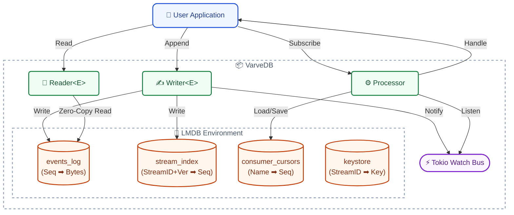

# Architecture

VarveDB is built on a layered architecture that separates storage concerns from the high-level event sourcing API.

## High-Level Overview

The system consists of three main components that interact with the underlying storage:

1.  **Writer**: Handles appending events to the log. It manages transactions, concurrency control, and encryption.
2.  **Reader**: Provides efficient access to stored events. It uses zero-copy deserialization to read data directly from the memory-mapped file.
3.  **Processor**: A background task that subscribes to new events and dispatches them to registered handlers.

## Storage Layer (LMDB)

VarveDB uses **LMDB** as its storage engine. LMDB is a B-tree-based key-value store that is memory-mapped, providing read performance comparable to in-memory data structures.

### Data Layout

Data is organized into several "databases" (tables) within the LMDB environment:

*   **`events_log`**: The main append-only log.
    *   **Key**: Global Sequence Number (`u64`, big-endian).
    *   **Value**: Serialized event data (rkyv bytes).
*   **`stream_index`**: Maps stream versions to global sequence numbers.
    *   **Key**: `StreamID` + `StreamVersion`.
    *   **Value**: Global Sequence Number.
*   **`consumer_cursors`**: Tracks the progress of event processors.
    *   **Key**: Consumer Group Name (`String`).
    *   **Value**: Last Processed Global Sequence Number.
*   **`keystore`**: Stores encryption keys for streams (if encryption is enabled).
    *   **Key**: `StreamID`.
    *   **Value**: Encrypted Stream Key (wrapped with Master Key).

## Serialization (rkyv)

VarveDB uses **rkyv** for serialization. Unlike Serde, which typically deserializes data into new heap-allocated structs, rkyv guarantees a memory representation that is the same on disk as it is in memory.

This allows the `Reader` to return references to the data inside the memory-mapped file, completely avoiding memory allocation and copying during reads.

## Concurrency Model

*   **Writes**: LMDB allows only one write transaction at a time. The `Writer` ensures that appends are serialized.
*   **Reads**: Multiple read transactions can occur in parallel without blocking writes.
*   **Optimistic Concurrency**: When appending to a stream, the user must provide the *expected* version of that stream. If the current version in the `stream_index` does not match, the write is rejected with a `ConcurrencyConflict` error.

## Encryption

When encryption is enabled:
1.  A unique 256-bit key is generated for each new stream.
2.  This stream key is encrypted (wrapped) using the provided **Master Key** and stored in the `keystore`.
3.  Events appended to the stream are encrypted using the stream key and AES-256-GCM.
4.  The `StreamID` and `SequenceNumber` are used as Additional Authenticated Data (AAD) to bind the ciphertext to its specific location, preventing replay attacks (e.g., copying a valid encrypted event from one stream to another).
